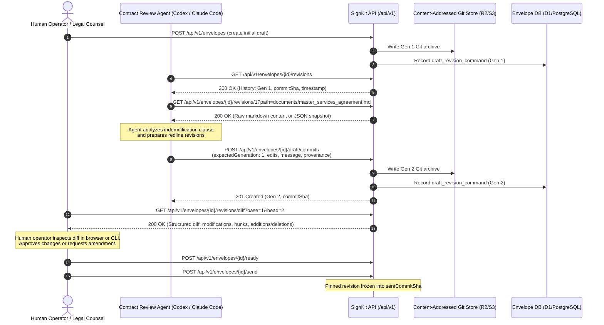

# Contract Review Workflow

Status: implemented

## 1. Overview

SignKit envelopes back contract drafting with an immutable, content-addressed Git repository. The revision history and diff API surfaces (`/api/v1/envelopes/{envelopeId}/revisions/**`) let authorized agents and operators review contract revisions while verifying archive integrity and keeping internal storage keys out of responses. Contract content itself is returned to callers with `envelopes:read` access.

## 2. API Endpoints

All revision endpoints require `envelopes:read` authorization through an active API key or operator session cookie:

- `GET /api/v1/envelopes/{envelopeId}/revisions`: Bounded paginated list of draft revisions (`limit` default 50, max 100; `cursor` integer generation).
- `GET /api/v1/envelopes/{envelopeId}/revisions/{revisionRef}`: Exact revision snapshot by integer generation or 40-character hexadecimal Git commit SHA. Supports optional `?path=documents/<slug>.md` query filter and `Accept: text/markdown` or `Accept: text/plain` content negotiation.
- `GET /api/v1/envelopes/{envelopeId}/revisions/diff`: Structured bounded document-set diff across Markdown and PDF manifest leaves between `base` and `head` revisions (defaulting to previous and current). Supports unified diff plain text via `?format=text` or `Accept: text/plain`.

## 3. End-to-End Review Example (Codex / Claude Code Pair Workflow)



### Step 1: Base Revision Inspection

The agent or reviewer queries the envelope's revision history:

```http
GET /api/v1/envelopes/01900000-0000-7000-8000-000000000001/revisions?limit=10 HTTP/1.1
Authorization: Bearer signkit_...
```

Response:

```json
{
	"revisions": [
		{
			"generation": 1,
			"commitSha": "3a4f8d2e1b0c9e8d7f6a5b4c3d2e1f0a9b8c7d6e",
			"timestamp": "2026-09-24T10:00:00.000Z",
			"message": "Initial master services agreement draft",
			"actorType": "user"
		}
	],
	"truncated": false,
	"nextCursor": null
}
```

### Step 2: Proposing Revisions

The agent commits proposed redlines:

```http
POST /api/v1/envelopes/01900000-0000-7000-8000-000000000001/draft/commits HTTP/1.1
Authorization: Bearer signkit_...
Idempotency-Key: agent-review-rev2
Content-Type: application/json

{
  "expectedGeneration": 1,
  "message": "Cap liability to 12 months fees and clarify IP warranty",
  "edits": [
    {
      "path": "documents/agreement.md",
      "content": "# Agreement\n\nLiability is capped at total fees paid in previous 12 months."
    }
  ],
  "provenance": {
    "automationRunId": "codex-run-84920",
    "externalId": "pr-402"
  }
}
```

### Step 3: Structured Bounded Diff Inspection

Human legal counsel or automated verification tools review the diff:

```http
GET /api/v1/envelopes/01900000-0000-7000-8000-000000000001/revisions/diff?base=1&head=2 HTTP/1.1
Authorization: Bearer signkit_...
```

Response:

```json
{
	"schema": "signkit-revision-diff-v1",
	"base": {
		"generation": 1,
		"commitSha": "3a4f8d2e1b0c9e8d7f6a5b4c3d2e1f0a9b8c7d6e"
	},
	"head": {
		"generation": 2,
		"commitSha": "7b8a9c0d1e2f3a4b5c6d7e8f9a0b1c2d3e4f5a6b",
		"message": "Cap liability to 12 months fees and clarify IP warranty"
	},
	"summary": {
		"documentsAdded": 0,
		"documentsRemoved": 0,
		"documentsModified": 1,
		"documentsReordered": 0,
		"titlesChanged": 0,
		"totalChanges": 1
	},
	"changes": [
		{
			"documentId": "01900000-0000-7000-8000-000000000010",
			"kind": "markdown",
			"path": "documents/agreement.md",
			"changeType": "modified",
			"addition": false,
			"removal": false,
			"titleChanged": false,
			"orderChanged": false,
			"contentChanged": true,
			"title": { "current": "Agreement", "previous": "Agreement", "changed": false },
			"position": { "current": 0, "previous": 0, "changed": false },
			"content": {
				"changed": true,
				"previousSha256": "4b92f2c1a0...",
				"currentSha256": "8a31d9e2b4...",
				"unifiedDiff": "--- a/documents/agreement.md\n+++ b/documents/agreement.md\n@@ -1,2 +1,2 @@\n # Agreement\n-Liability is unlimited.\n+Liability is capped at total fees paid in previous 12 months.\n",
				"additions": 1,
				"deletions": 1
			}
		}
	],
	"unifiedText": "diff --git a/documents/agreement.md b/documents/agreement.md\n--- a/documents/agreement.md\n+++ b/documents/agreement.md\n@@ -1,2 +1,2 @@\n # Agreement\n-Liability is unlimited.\n+Liability is capped at total fees paid in previous 12 months.\n",
	"truncated": false
}
```

Or as unified diff text directly:

```http
GET /api/v1/envelopes/01900000-0000-7000-8000-000000000001/revisions/diff?base=1&head=2&format=text HTTP/1.1
Authorization: Bearer signkit_...
```

### Step 4: Verification and Sending

Once approved by counsel, the envelope readiness is pinned (`POST /ready`) and sent (`POST /send`). The final execution artifact pins `sentCommitSha`, providing an end-to-end verifiable audit trail from initial draft through all agent and human revisions to final signature.

## 4. Security & Privacy Guarantees

- **Authorization**: Scoped strictly to `envelopes:read`. No mutation or administrative capabilities are exposed.
- **Data Confidentiality**:
  - Internal storage keys (`archiveKey`) are never disclosed.
  - Recipient and author email addresses are completely excluded.
  - Capability secrets and session tokens are never disclosed.
  - Audit event hashes are never disclosed.
- **Fail-Closed Content Integrity**: Exact revision reads and diffs verify the immutable archive SHA-256 digest, pinned Git HEAD, and clean worktree before returning document content. A mismatch returns HTTP 503. History pages return bounded metadata from the durable revision command and its matching audit payload without fetching every archive; legacy rows without an audited message use a verified archive fallback.
